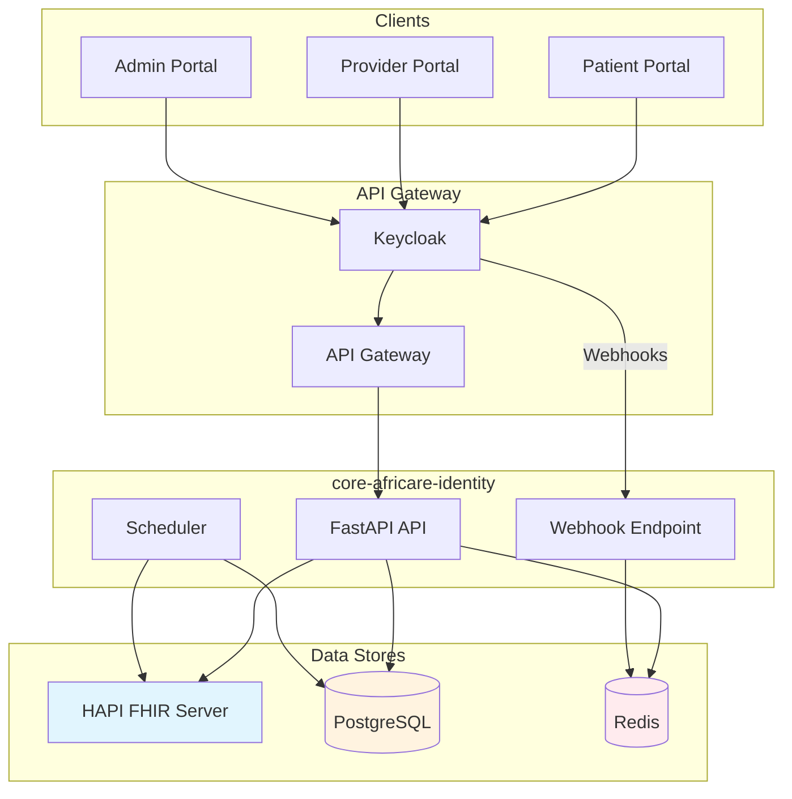

# Documentation core-africare-identity

Documentation technique du service d'identite AfriCare.

## Table des matieres

### Architecture

| Document | Description |
|----------|-------------|
| [Architecture FHIR Hybride](./architecture/fhir-hybrid.md) | Architecture Patient/Professional avec HAPI FHIR + PostgreSQL GDPR |
| [Base de donnees](./architecture/database.md) | Configuration SQLAlchemy 2.0 avec PostgreSQL |
| [Systeme d'evenements](./architecture/events.md) | Redis Pub/Sub pour communication inter-services |

### Securite

| Document | Description |
|----------|-------------|
| [Authentification Keycloak](./security/authentication.md) | Integration Keycloak, JWT, RBAC |
| [Webhooks Keycloak](./security/webhooks.md) | Architecture Redis Streams, filtrage, validation |

### RGPD

| Document | Description |
|----------|-------------|
| [Workflow de suppression](./rgpd/deletion-workflow.md) | Soft delete, periode de grace, anonymisation |
| [API Admin RGPD](./rgpd/admin-api.md) | Endpoints administrateur pour gestion RGPD |

### Developpement

| Document | Description |
|----------|-------------|
| [Guide de test](./development/testing.md) | Tests unitaires, integration, HAPI FHIR |
| [Variables d'environnement](./development/environment.md) | Configuration et listes |
| [Gestion d'erreurs RFC 9457](./development/error-handling.md) | Problem Details for HTTP APIs |

## Diagramme d'architecture

## Stack technique

| Composant | Technologie | Version |
|-----------|-------------|---------|
| Framework | FastAPI | 0.115+ |
| ORM | SQLAlchemy | 2.0+ |
| Base de donnees | PostgreSQL | 18 |
| Cache/Messaging | Redis | 7 |
| FHIR Server | HAPI FHIR | Latest |
| Auth | Keycloak | 17+ |
| Observabilite | OpenTelemetry | Auto-instrumentation |

## Conventions

- **Diagrammes**: Mermaid uniquement (pas d'ASCII art)
- **Langue**: Francais pour documentation, anglais pour code
- **Format**: Markdown avec Table of Contents
- **Organisation**: Par domaine (architecture, security, rgpd, development)
