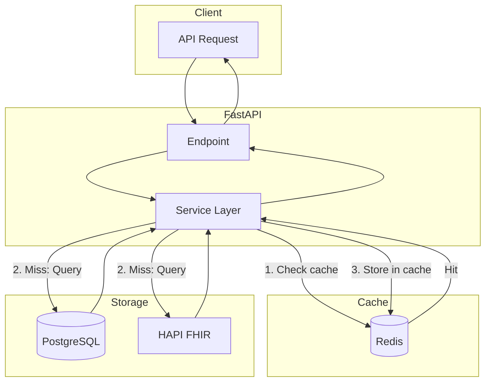
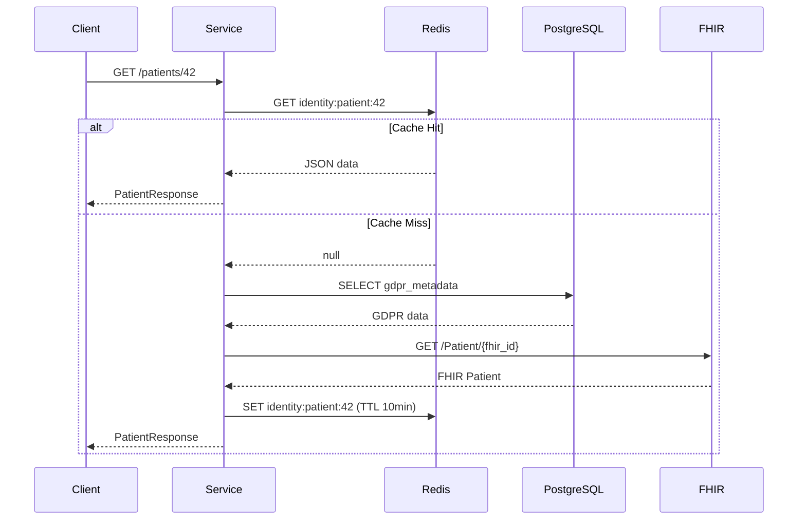
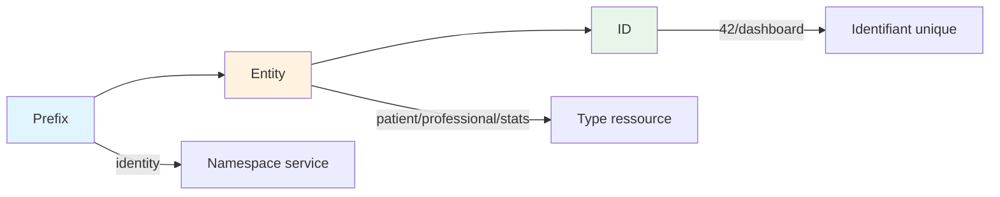
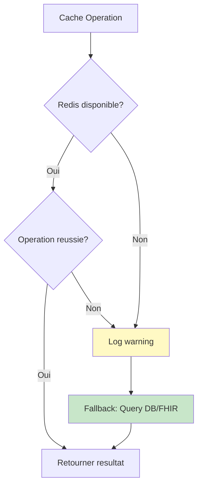
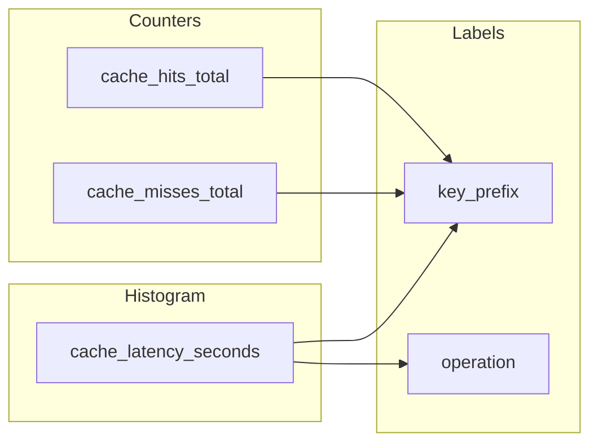

# Strategie de Cache Redis

## Vue d'ensemble

Le service core-africare-identity utilise Redis comme cache applicatif pour
ameliorer les temps de reponse des endpoints frequemment sollicites.

**Strategie**: Cache-Aside (Lazy Loading) avec invalidation TTL uniquement.

**Endpoints caches**:
- `GET /api/v1/patients/{id}` - TTL 10 minutes
- `GET /api/v1/professionals/{id}` - TTL 10 minutes
- `GET /api/v1/statistics/dashboard` - TTL 5 minutes

## Architecture



## Strategie Cache-Aside (Lazy Loading)



## Politique TTL (Time-To-Live)

```mermaid
gantt
    title TTL par type de donnees
    dateFormat X
    axisFormat %s

    section Patient
    TTL 600s (10 min)    :0, 600

    section Professional
    TTL 600s (10 min)    :0, 600

    section Statistics
    TTL 300s (5 min)     :0, 300
```



| Ressource | TTL | Justification |
|-----------|-----|---------------|
| Patient | 10 min | Donnees stables, mises a jour rares |
| Professional | 10 min | Donnees stables, mises a jour rares |
| Statistics | 5 min | Agregations, tolerance a la legerete de staleness |

## Convention de Nommage des Cles



**Pattern**: `{service}:{entity}:{identifier}`

**Exemples**:
- `identity:patient:42`
- `identity:professional:123`
- `identity:stats:dashboard`

## Gestion des Erreurs



**Principe**: Les erreurs cache ne cassent jamais l'application.

```python
try:
    value = await redis_client.get(key)
except Exception as e:
    logger.warning(f"Cache GET error: {e}")
    return None  # Graceful degradation -> query DB/FHIR
```

## Metriques OpenTelemetry



**Metriques exportees**:

| Metrique | Type | Labels | Description |
|----------|------|--------|-------------|
| `cache_hits_total` | Counter | `key_prefix` | Nombre de cache hits |
| `cache_misses_total` | Counter | `key_prefix` | Nombre de cache misses |
| `cache_latency_seconds` | Histogram | `operation`, `key_prefix` | Latence des operations |

**Queries Prometheus/Grafana**:

```promql
# Taux de cache hit (%)
sum(rate(cache_hits_total[5m])) /
(sum(rate(cache_hits_total[5m])) + sum(rate(cache_misses_total[5m]))) * 100

# Latence P95 par operation
histogram_quantile(0.95, sum(rate(cache_latency_seconds_bucket[5m])) by (le, operation))
```

## Configuration

Variables d'environnement:

| Variable | Default | Description |
|----------|---------|-------------|
| `CACHE_ENABLED` | `true` | Active/desactive le cache |
| `CACHE_TTL_DEFAULT` | `300` | TTL par defaut (secondes) |
| `CACHE_TTL_PATIENT` | `600` | TTL patient (secondes) |
| `CACHE_TTL_PROFESSIONAL` | `600` | TTL professional (secondes) |
| `CACHE_TTL_STATS_DASHBOARD` | `300` | TTL statistiques (secondes) |

## Usage dans le Code

### Lecture avec cache

```python
from app.core.cache import cache_get, cache_key_patient
from app.schemas.patient import PatientResponse

cache_key = cache_key_patient(patient_id)
cached_json = await cache_get(cache_key)
if cached_json:
    return PatientResponse.model_validate_json(cached_json)
```

### Ecriture en cache

```python
from app.core.cache import cache_set
from app.core.config import settings

await cache_set(
    cache_key,
    response.model_dump_json(),
    ttl=settings.CACHE_TTL_PATIENT
)
```

### Generateurs de cles

```python
from app.core.cache import (
    cache_key_patient,
    cache_key_professional,
    cache_key_stats_dashboard,
)

# Patient par ID
key = cache_key_patient(42)  # "identity:patient:42"

# Professional par ID
key = cache_key_professional(123)  # "identity:professional:123"

# Dashboard stats
key = cache_key_stats_dashboard()  # "identity:stats:dashboard"
```

## Rollback d'urgence

Pour desactiver le cache en cas de probleme:

```bash
# Dans .env ou variable d'environnement
CACHE_ENABLED=false
```

**Effet**: Toutes les operations cache retournent null/false, fallback automatique sur DB/FHIR.
Aucune modification de code requise.

## Tests

Les tests unitaires pour le cache sont dans `tests/unit/test_cache.py`:

```bash
# Executer les tests cache
poetry run pytest tests/unit/test_cache.py -v

# Avec couverture
poetry run pytest tests/unit/test_cache.py --cov=app.core.cache -v
```

## Fichiers Concernes

- `app/core/cache.py` - Module de cache (get, set, delete, key generators)
- `app/core/config.py` - Configuration TTL
- `app/services/patient_service.py` - Integration cache patient
- `app/services/professional_service.py` - Integration cache professional
- `app/services/statistics_service.py` - Integration cache dashboard
- `tests/unit/test_cache.py` - Tests unitaires
