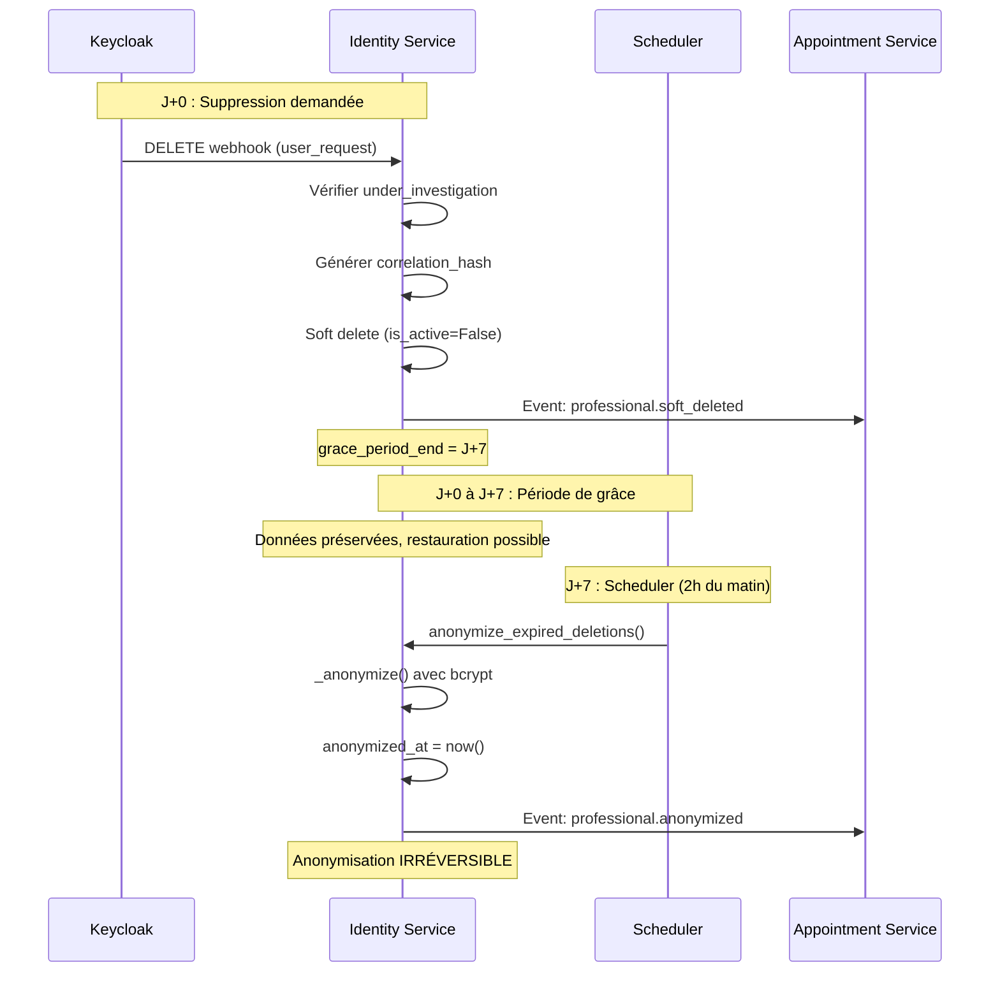
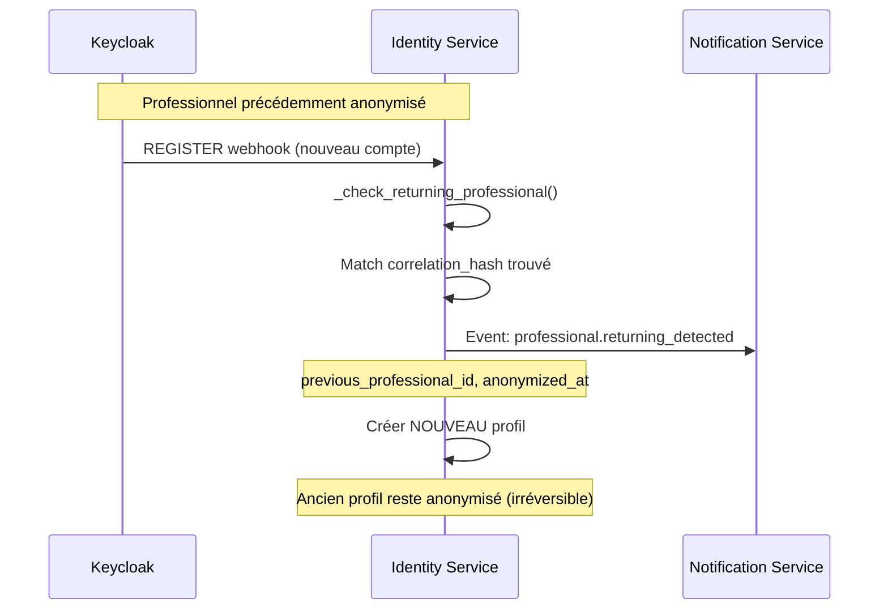
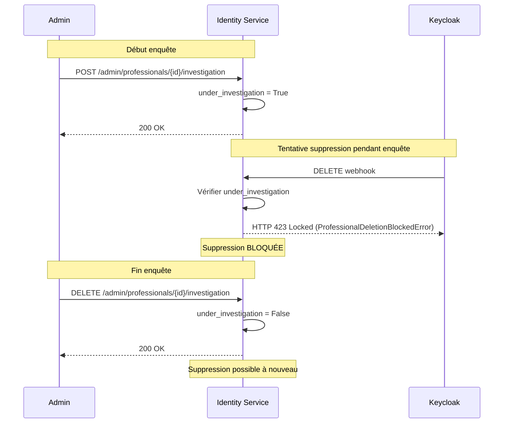
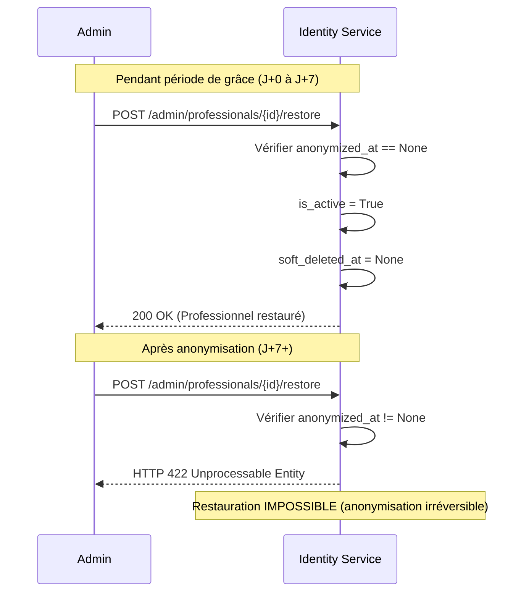

# Amélioration Gestion Suppression Professionnels

> **Note Architecture FHIR (Décembre 2025)**
>
> Ce document a été écrit avant la migration vers l'architecture hybride FHIR.
> Avec la nouvelle architecture:
> - Les données démographiques sont stockées dans **HAPI FHIR** (Practitioner)
> - Les métadonnées GDPR sont dans **PostgreSQL** via la table `professional_gdpr_metadata`
> - Le workflow de suppression reste identique
>
> Voir `docs/fhir-architecture.md` pour l'architecture actuelle.

## Statut : ✅ COMPLÉTÉ (Phases 1-3 implémentées)

Cette feature améliore la gestion de suppression des professionnels de santé avec :
- ✅ Période de grâce de 7 jours avant anonymisation définitive
- ✅ Blocage des suppressions pendant enquêtes médico-légales
- ✅ Système de corrélation pour détecter retours après anonymisation
- ✅ Raisons de suppression enrichies
- ✅ Endpoints administrateur pour gestion avancée
- ✅ Anonymisation automatique schedulée
- ✅ Tests unitaires et E2E complets

---

## ✅ Phase 1 : Fondations (COMPLÉTÉ)

### Commit 1 : Modèle de données

**Nouveaux champs `Professional`** :

```python
# Enquête médico-légale (bloque suppression)
under_investigation: Mapped[bool] = mapped_column(default=False)
investigation_notes: Mapped[str | None] = mapped_column(String(1000), default=None)

# Corrélation pour détecter retours
correlation_hash: Mapped[str | None] = mapped_column(String(64), index=True, default=None)

# Soft delete avec période de grâce
soft_deleted_at: Mapped[datetime | None] = mapped_column(DateTime(timezone=True), default=None)
anonymized_at: Mapped[datetime | None] = mapped_column(DateTime(timezone=True), default=None)

# Raisons de suppression enrichies
deletion_reason: Mapped[str | None] = mapped_column(
    String(50),
    default=None,
    comment="user_request, admin_termination, professional_revocation, gdpr_compliance, prolonged_inactivity"
)
```

**Migration Alembic** : `23f6c23e1f1b`
- 5 nouvelles colonnes avec indices
- Server default pour `under_investigation=false`
- Rétro-compatible avec données existantes

### Commit 2 : Schémas et Exceptions

**Nouvelle exception RFC 9457** :
```python
class ProfessionalDeletionBlockedError(HTTPException):
    """Levée quand suppression bloquée (under_investigation=True)."""
    status_code: int = 423  # Locked
```

**Nouveaux schémas Pydantic** :
```python
DeletionReason = Literal[
    "user_request",
    "admin_termination",
    "professional_revocation",
    "gdpr_compliance",
    "prolonged_inactivity",
]

class ProfessionalDeletionRequest(BaseModel):
    deletion_reason: DeletionReason
    investigation_check_override: bool = False
    notes: str | None

class ProfessionalRestoreRequest(BaseModel):
    restore_reason: NonEmptyStr
    notes: str | None

class ProfessionalDeletionContext(BaseModel):
    reason: str | None

class AnonymizationStatus(BaseModel):
    professional_id: ProfessionalId
    keycloak_user_id: str
    email: str
    soft_deleted_at: datetime | None
    anonymized_at: datetime | None
    deletion_reason: DeletionReason | None
```

### Commit 3 : Système de Corrélation

**Fonctions implémentées** :
```python
def _generate_correlation_hash(email: str, professional_id: str | None) -> str:
    """Hash SHA-256 déterministe pour corrélation anonymisée.

    Args:
        email: Email du professionnel
        professional_id: Numéro d'ordre professionnel (optionnel)

    Returns:
        Hash SHA-256 (64 caractères hexadécimaux)
    """

async def _check_returning_professional(
    db: AsyncSession,
    email: str,
    professional_id: str | None
) -> Professional | None:
    """Détecte si professionnel anonymisé revient.

    Recherche un professionnel anonymisé ayant le même correlation_hash.

    Returns:
        Professional anonymisé si trouvé, None sinon
    """
```

**Tests unitaires** : `tests/unit/test_correlation_hash.py` (6 tests)

---

## ✅ Phase 2 : Logique Métier (COMPLÉTÉ)

### Commit 4-5 : Soft Delete avec Période de Grâce

**Implémentation `sync_user_deletion()`** :

```python
async def sync_user_deletion(
    db: AsyncSession,
    event: KeycloakWebhookEvent,
    strategy: Literal["soft_delete", "immediate_anonymize"] = "soft_delete"
) -> SyncResult:
    """Gère suppression professionnel depuis webhook Keycloak.

    Workflow:
    1. Vérifier under_investigation (bloquer si True)
    2. Générer correlation_hash AVANT anonymisation
    3. Soft delete: is_active=False, soft_deleted_at=now()
    4. Publier événement identity.professional.soft_deleted
    """
    # Vérifier blocage enquête
    if professional.under_investigation:
        raise ProfessionalDeletionBlockedError(
            professional_id=professional.id,
            reason="under_investigation",
            investigation_notes=professional.investigation_notes
        )

    # Générer correlation_hash
    professional.correlation_hash = _generate_correlation_hash(
        professional.email,
        professional.professional_id
    )

    # Soft delete
    professional.is_active = False
    professional.soft_deleted_at = datetime.now(UTC)
    professional.deletion_reason = event.deletion_reason or "user_request"

    # Publier événement
    await publish("identity.professional.soft_deleted", {
        "professional_id": professional.id,
        "keycloak_user_id": professional.keycloak_user_id,
        "anonymization_scheduled_at": (datetime.now(UTC) + timedelta(days=7)).isoformat(),
        "grace_period_days": 7,
        "deletion_reason": professional.deletion_reason
    })
```

**Événements publiés** :
- `identity.professional.soft_deleted` : Soft delete effectué, période de grâce commence
- `identity.professional.deletion_blocked` : Suppression bloquée (enquête en cours)

### Commit 6 : Anonymisation Différée

**Scheduler APScheduler** :
```python
# app/scheduler.py
from apscheduler.schedulers.asyncio import AsyncIOScheduler
from apscheduler.triggers.cron import CronTrigger

scheduler = AsyncIOScheduler()

@scheduler.scheduled_job(CronTrigger(hour=2, minute=0))
async def run_anonymization():
    """Tâche quotidienne (2h du matin) pour anonymiser professionnels expirés."""
    async with get_session() as db:
        count = await anonymize_expired_deletions(db)
        logger.info(f"Anonymisation: {count} professionnels traités")
```

**Fonction `anonymize_expired_deletions()`** :
```python
async def anonymize_expired_deletions(db: AsyncSession) -> int:
    """Anonymise professionnels avec période de grâce expirée (> 7 jours).

    Workflow:
    1. Trouver professionnels soft_deleted_at < now() - 7 days
    2. Pour chacun: appeler _anonymize()
    3. Définir anonymized_at = now()
    4. Publier identity.professional.anonymized

    Returns:
        Nombre de professionnels anonymisés
    """
    cutoff_date = datetime.now(UTC) - timedelta(days=7)

    # Trouver professionnels expirés
    result = await db.execute(
        select(Professional).where(
            Professional.soft_deleted_at < cutoff_date,
            Professional.soft_deleted_at.isnot(None),
            Professional.anonymized_at.is_(None)
        )
    )
    professionals = result.scalars().all()

    # Anonymiser chacun
    for professional in professionals:
        await _anonymize(db, professional)
        professional.anonymized_at = datetime.now(UTC)

        await publish("identity.professional.anonymized", {
            "professional_id": professional.id,
            "anonymized_at": professional.anonymized_at.isoformat(),
            "correlation_hash": professional.correlation_hash
        })

    await db.commit()
    return len(professionals)
```

**Fonction `_anonymize()`** :
```python
async def _anonymize(db: AsyncSession, professional: Professional) -> None:
    """Anonymise irréversiblement les données personnelles avec bcrypt.

    Hash avec bcrypt (coût 12):
    - first_name
    - last_name
    - email

    Remplacements:
    - phone → "+ANONYMIZED"
    - phone_secondary → None

    PRÉSERVE:
    - correlation_hash (pour détection retours)
    - professional_type, specialty (agrégation statistique)
    """
    import bcrypt

    # Hash bcrypt (irréversible)
    professional.first_name = bcrypt.hashpw(
        professional.first_name.encode(),
        bcrypt.gensalt(rounds=12)
    ).decode()
    professional.last_name = bcrypt.hashpw(
        professional.last_name.encode(),
        bcrypt.gensalt(rounds=12)
    ).decode()
    professional.email = bcrypt.hashpw(
        professional.email.encode(),
        bcrypt.gensalt(rounds=12)
    ).decode()

    # Remplacements
    professional.phone = "+ANONYMIZED"
    professional.phone_secondary = None
```

### Commit 7 : Détection Retours

**Modifications `sync_user_registration()`** :
```python
async def sync_user_registration(
    db: AsyncSession,
    event: KeycloakWebhookEvent
) -> SyncResult:
    """Enregistre nouveau professionnel, détecte retours après anonymisation."""

    # Vérifier si professionnel anonymisé revient
    returning = await _check_returning_professional(
        db,
        event.user.email,
        event.professional_id
    )

    if returning:
        # Publier événement de détection
        await publish("identity.professional.returning_detected", {
            "new_keycloak_user_id": event.user_id,
            "previous_professional_id": returning.id,
            "anonymized_at": returning.anonymized_at.isoformat(),
            "correlation_hash": returning.correlation_hash,
            "message": "Professional previously anonymized has returned"
        })

    # Créer NOUVEAU profil (anonymisation irréversible)
    professional = Professional(
        keycloak_user_id=event.user_id,
        email=event.user.email,
        # ... autres champs
    )
    db.add(professional)
    await db.commit()

    return SyncResult(success=True, patient_id=professional.id)
```

**Événements publiés** :
- `identity.professional.returning_detected` : Professionnel anonymisé revient
- `identity.professional.registered` : Nouvel enregistrement (incluant retours)

---

## ✅ Phase 3 : API et Tests (COMPLÉTÉ)

### Commit 8 : Endpoints Administrateur

**POST `/api/v1/admin/professionals/{id}/investigation`** :
```python
@router.post("/{professional_id}/investigation", response_model=ProfessionalResponse)
async def mark_professional_under_investigation(
    professional_id: int,
    context: ProfessionalDeletionContext,
    db: AsyncSession = Depends(get_session),
) -> ProfessionalResponse:
    """Marque professionnel comme sous enquête médico-légale.

    Bloque toute tentative de suppression tant que enquête active.

    Returns:
        Professionnel mis à jour

    Raises:
        HTTPException 404: Professionnel non trouvé
    """
```

**Exemple d'utilisation** :
```bash
curl -X POST "http://localhost:8001/api/v1/admin/professionals/123/investigation" \
  -H "Authorization: Bearer $ADMIN_TOKEN" \
  -H "Content-Type: application/json" \
  -d '{
    "reason": "Enquête médico-légale suite plainte patient"
  }'
```

**DELETE `/api/v1/admin/professionals/{id}/investigation`** :
```python
@router.delete("/{professional_id}/investigation", response_model=ProfessionalResponse)
async def remove_investigation_status(
    professional_id: int,
    db: AsyncSession = Depends(get_session),
) -> ProfessionalResponse:
    """Retire statut d'enquête d'un professionnel.

    Permet de nouveau la suppression du professionnel.
    """
```

**POST `/api/v1/admin/professionals/{id}/restore`** :
```python
@router.post("/{professional_id}/restore", response_model=ProfessionalResponse)
async def restore_soft_deleted_professional(
    professional_id: int,
    restore_request: ProfessionalRestoreRequest,
    db: AsyncSession = Depends(get_session),
) -> ProfessionalResponse:
    """Restaure professionnel soft deleted (pendant période de grâce).

    Impossible de restaurer si déjà anonymisé.

    Returns:
        Professionnel restauré

    Raises:
        HTTPException 404: Professionnel non trouvé
        HTTPException 422: Déjà anonymisé (irréversible)
    """
```

**Exemple d'utilisation** :
```bash
curl -X POST "http://localhost:8001/api/v1/admin/professionals/123/restore" \
  -H "Authorization: Bearer $ADMIN_TOKEN" \
  -H "Content-Type: application/json" \
  -d '{
    "restore_reason": "Erreur administrative - professionnel réintégré",
    "notes": "Validation du directeur médical"
  }'
```

**GET `/api/v1/admin/professionals/deleted`** :
```python
@router.get("/deleted", response_model=list[AnonymizationStatus])
async def list_soft_deleted_professionals(
    db: AsyncSession = Depends(get_session),
) -> list[AnonymizationStatus]:
    """Liste professionnels soft deleted en attente d'anonymisation.

    Retourne uniquement ceux dans période de grâce (pas encore anonymisés).
    """
```

**Exemple de réponse** :
```json
[
  {
    "professional_id": 123,
    "keycloak_user_id": "user-abc-123",
    "email": "dr.diop@hospital.sn",
    "soft_deleted_at": "2025-01-08T10:30:00Z",
    "anonymized_at": null,
    "deletion_reason": "user_request"
  }
]
```

### Commit 9 : Tests d'Intégration E2E

**Fichier** : `tests/integration/test_professional_deletion_e2e.py`

**3 tests E2E** :

1. **`test_complete_professional_lifecycle_with_return`** (90 lignes)
   ```python
   # STEP 1: Enregistrement initial
   register_event = KeycloakWebhookEvent(event_type="REGISTER", ...)
   result = await sync_user_registration(db_session, register_event)
   assert result.success is True

   # STEP 2: Soft delete
   delete_event = KeycloakWebhookEvent(event_type="DELETE", deletion_reason="user_request")
   result = await sync_user_deletion(db_session, delete_event, strategy="soft_delete")
   assert professional.correlation_hash == expected_hash

   # STEP 3: Anonymisation après 8 jours
   professional.soft_deleted_at = datetime.now(UTC) - timedelta(days=8)
   count = await anonymize_expired_deletions(db_session)
   assert count == 1
   assert professional.first_name.startswith("$2b$")  # bcrypt hash

   # STEP 4: Retour détecté
   return_event = KeycloakWebhookEvent(event_type="REGISTER", user=KeycloakUser(email=original_email))
   result = await sync_user_registration(db_session, return_event)
   assert result.patient_id != professional_id  # Nouveau profil créé
   ```

2. **`test_professional_deletion_blocked_under_investigation`** (45 lignes)
   ```python
   # Professionnel sous enquête
   professional.under_investigation = True
   professional.investigation_notes = "Enquête médico-légale en cours"

   # Tentative de suppression (doit échouer)
   with pytest.raises(ProfessionalDeletionBlockedError) as exc_info:
       await sync_user_deletion(db_session, delete_event, strategy="soft_delete")

   assert exc_info.value.status_code == 423  # Locked
   ```

3. **`test_anonymization_grace_period_7_days`** (53 lignes)
   ```python
   # 2 professionnels : 3 jours vs 8 jours
   recent = Professional(soft_deleted_at=datetime.now(UTC) - timedelta(days=3))
   expired = Professional(soft_deleted_at=datetime.now(UTC) - timedelta(days=8))

   # Exécuter scheduler
   count = await anonymize_expired_deletions(db_session)

   # Seul expired anonymisé
   assert count == 1
   assert recent.anonymized_at is None
   assert expired.anonymized_at is not None
   ```

### Commit 10 : Documentation

- ✅ Mise à jour `docs/professional-deletion-improvements.md` (ce fichier)
- ✅ Diagrammes de séquence (voir section suivante)
- ✅ Exemples d'utilisation API
- ✅ Guide d'intégration scheduler

---

## Diagrammes de Séquence

### Workflow Suppression Normale



### Workflow Détection Retour



### Workflow Enquête Médico-Légale



### Workflow Restauration



---

## Configuration

### Variables d'Environnement

```bash
# Salt pour génération correlation_hash (optionnel, défaut fourni)
CORRELATION_HASH_SALT=africare-identity-salt-v1

# Scheduler APScheduler (automatiquement démarré avec le service)
# Tâche quotidienne à 2h du matin pour anonymisation
```

### Dépendances

```toml
# pyproject.toml (déjà installées)
apscheduler = "^3.10.4"  # Scheduler pour anonymisation J+7
bcrypt = "^4.1.2"        # Hashing irréversible
```

### Démarrage du Scheduler

Le scheduler est automatiquement démarré dans le lifespan de FastAPI :

```python
# app/main.py
from app.scheduler import scheduler

@asynccontextmanager
async def lifespan(app: FastAPI):
    # Startup
    scheduler.start()
    logger.info("Scheduler APScheduler démarré (anonymisation quotidienne à 2h)")

    yield

    # Shutdown
    scheduler.shutdown()
    logger.info("Scheduler APScheduler arrêté")
```

---

## Tests

### Tests Unitaires

**`tests/unit/test_correlation_hash.py`** (6 tests)
- Génération hash déterministe
- Détection retours avec hash matching
- Gestion None values

**`tests/unit/test_soft_delete_workflow.py`** (5 tests)
- Soft delete basique
- Blocage si under_investigation
- Génération correlation_hash
- Publication événements

**`tests/unit/test_anonymize_expired_deletions.py`** (4 tests)
- Anonymisation après 7 jours
- Préservation période de grâce
- Hash bcrypt vérifié
- Événements publiés

**`tests/unit/test_admin_endpoints_deletion.py`** (5 tests)
- Mark/remove investigation status
- Restauration pendant période de grâce
- Blocage restauration après anonymisation
- Liste soft deleted

### Tests d'Intégration

**`tests/integration/test_professional_deletion_e2e.py`** (3 tests)
- Lifecycle complet avec retour
- Blocage enquête médico-légale
- Validation période de grâce 7 jours

### Exécution des Tests

```bash
# Tous les tests
make test

# Tests unitaires uniquement
make test-unit

# Tests d'intégration uniquement
make test-integration

# Tests spécifiques
poetry run pytest tests/unit/test_admin_endpoints_deletion.py -v
poetry run pytest tests/integration/test_professional_deletion_e2e.py -v

# Avec couverture
poetry run pytest --cov=app --cov-report=html --cov-report=term-missing
```

---

## Workflow Complet

### Suppression Normale

1. **J+0** : Événement DELETE reçu
   - Vérifier `under_investigation` → bloquer si True
   - Générer `correlation_hash`
   - Soft delete : `is_active=False`, `soft_deleted_at=now()`
   - Publier événement `identity.professional.soft_deleted` avec `grace_period_end`

2. **J+0 à J+7** : Période de grâce
   - Professionnel désactivé mais données préservées
   - Restauration possible via API admin
   - Rendez-vous maintenus en attente

3. **J+7** : Anonymisation automatique (2h du matin)
   - Tâche schedulée détecte expiration
   - Appelle `_anonymize()` : Hash bcrypt irréversible
   - Définit `anonymized_at`
   - Publier `identity.professional.anonymized`
   - Rendez-vous réaffectés ou annulés

### Détection Retour

1. Nouveau professionnel s'inscrit
2. `_check_returning_professional()` vérifie `correlation_hash`
3. Si match trouvé : Publier événement `identity.professional.returning_detected`
4. Créer nouveau profil (ancien irréversible)

### Enquête En Cours

1. Admin définit `under_investigation=True`
2. Toute tentative de suppression → HTTP 423 Locked
3. Enquête terminée → Admin définit `under_investigation=False`
4. Suppression possible à nouveau

---

## Événements Publiés

| Événement | Déclencheur | Payload |
|-----------|-------------|---------|
| `identity.professional.soft_deleted` | Soft delete effectué | `professional_id`, `anonymization_scheduled_at`, `grace_period_days` |
| `identity.professional.deletion_blocked` | Suppression bloquée (enquête) | `professional_id`, `reason`, `investigation_notes` |
| `identity.professional.anonymized` | Anonymisation exécutée | `professional_id`, `anonymized_at`, `correlation_hash` |
| `identity.professional.returning_detected` | Professionnel revient | `new_keycloak_user_id`, `previous_professional_id`, `anonymized_at` |
| `identity.professional.restored` | Restauration admin | `professional_id`, `restore_reason`, `restored_at` |
| `identity.professional.investigation_started` | Enquête démarrée | `professional_id`, `investigation_notes` |
| `identity.professional.investigation_cleared` | Enquête terminée | `professional_id`, `cleared_at` |

---

## Roadmap

- [x] **Phase 1** : Fondations (modèle, schémas, corrélation) - *COMPLÉTÉ*
- [x] **Phase 2** : Logique métier (soft delete, scheduler, événements) - *COMPLÉTÉ*
- [x] **Phase 3** : API et documentation - *COMPLÉTÉ*

**Total développement** : 10 commits suivant méthodologie TDD stricte

---

## Liens Utiles

- Migration Alembic : `alembic/versions/23f6c23e1f1b_*.py`
- Modèle : `app/models/professional.py`
- Schémas : `app/schemas/professional.py`
- Exceptions : `app/core/exceptions.py`
- Service sync : `app/services/keycloak_sync_service.py`
- Service scheduler : `app/services/anonymization_scheduler.py`
- Endpoints admin : `app/api/v1/endpoints/admin_professionals.py`
- Tests unitaires : `tests/unit/test_*_deletion*.py`
- Tests E2E : `tests/integration/test_professional_deletion_e2e.py`

---

## Support et Questions

Pour toute question ou problème :
- Consulter la documentation technique dans CLAUDE.md
- Vérifier les tests d'intégration pour exemples d'utilisation
- Consulter les logs du scheduler APScheduler pour diagnostics
