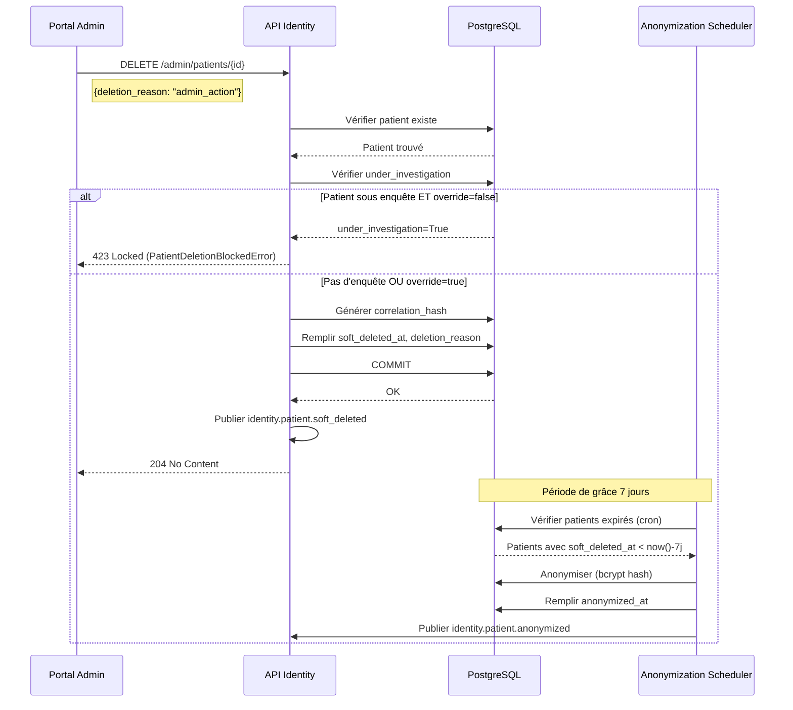

# API Admin - Suppression RGPD des Patients

## Contexte

Depuis l'implémentation de l'issue #6, la suppression de patients utilise un système RGPD-compliant avec:
- Période de grâce de 7 jours
- Anonymisation automatique après 7 jours
- Détection des utilisateurs revenant après anonymisation
- Blocage de suppression si patient sous enquête

## Endpoint de Suppression

### DELETE `/api/v1/admin/patients/{patient_id}`

**IMPORTANT**: Le portal admin doit utiliser cet endpoint `/admin/patients/{id}` et NON `/patients/{id}`.

#### Request Body (Optionnel)

Le body JSON est **optionnel**:
- **Sans body**: Utilise `deletion_reason="admin_action"` par défaut
- **Avec body**: Permet de spécifier raison, override, notes

```json
{
  "deletion_reason": "admin_action",
  "investigation_check_override": false,
  "notes": "Notes administratives optionnelles"
}
```

#### Paramètres

| Paramètre | Type | Requis | Défaut | Description |
|-----------|------|--------|--------|-------------|
| `deletion_reason` | string | ❌ | `"admin_action"` | Raison de la suppression (voir valeurs possibles ci-dessous) |
| `investigation_check_override` | boolean | ❌ | `false` | Force suppression même si `under_investigation=True` |
| `notes` | string | ❌ | `null` | Notes administratives (max 1000 caractères) |

#### Valeurs de `deletion_reason`

| Valeur | Description |
|--------|-------------|
| `user_request` | Demande du patient (RGPD Article 17) |
| `gdpr_compliance` | Conformité RGPD |
| `admin_action` | Action administrative |
| `prolonged_inactivity` | Inactivité prolongée (ex: 5 ans) |
| `duplicate_account` | Compte en double |
| `deceased` | Décès du patient |

#### Réponses

| Code | Description |
|------|-------------|
| `204 No Content` | ✅ Patient soft deleted avec succès |
| `404 Not Found` | ❌ Patient non trouvé |
| `423 Locked` | ⚠️ Patient sous enquête (bloqué), utiliser `investigation_check_override=true` pour forcer |

#### Exemple curl

```bash
# Suppression simplifiée (NOUVEAU - sans body)
curl -X DELETE "http://localhost:8001/api/v1/admin/patients/123"
# Utilise deletion_reason="admin_action" par défaut

# Suppression avec raison spécifique
curl -X DELETE "http://localhost:8001/api/v1/admin/patients/123" \
    -H "Content-Type: application/json" \
    -d '{
        "deletion_reason": "user_request",
        "notes": "Demande RGPD Article 17"
    }'

# Suppression forcée (patient sous enquête)
curl -X DELETE "http://localhost:8001/api/v1/admin/patients/456" \
    -H "Content-Type: application/json" \
    -d '{
        "deletion_reason": "gdpr_compliance",
        "investigation_check_override": true,
        "notes": "Override enquête pour conformité RGPD urgente"
    }'
```

#### Exemple JavaScript/TypeScript (Portal Admin)

```typescript
// Suppression simplifiée (sans body - RECOMMANDÉ)
async function deletePatient(patientId: number): Promise<void> {
  const response = await fetch(`/api/v1/admin/patients/${patientId}`, {
    method: 'DELETE',
    headers: {
      'Authorization': `Bearer ${accessToken}`
    }
  });

  if (response.status === 204) {
    console.log('Patient supprimé avec succès');
  } else if (response.status === 423) {
    // Patient sous enquête
    const shouldForce = confirm('Patient sous enquête. Forcer la suppression ?');
    if (shouldForce) {
      await deletePatientForce(patientId); // Voir fonction ci-dessous
    }
  } else {
    throw new Error(`Erreur suppression: ${response.status}`);
  }
}

// Suppression avec raison spécifique (optionnel)
async function deletePatientWithReason(
  patientId: number,
  reason: string,
  notes?: string
): Promise<void> {
  const response = await fetch(`/api/v1/admin/patients/${patientId}`, {
    method: 'DELETE',
    headers: {
      'Content-Type': 'application/json',
      'Authorization': `Bearer ${accessToken}`
    },
    body: JSON.stringify({
      deletion_reason: reason,
      notes: notes
    })
  });

  if (response.status === 204) {
    console.log('Patient supprimé avec succès');
  } else if (response.status === 423) {
    // Patient sous enquête
    const shouldForce = confirm('Patient sous enquête. Forcer la suppression ?');
    if (shouldForce) {
      await deletePatientForce(patientId);
    }
  } else {
    throw new Error(`Erreur suppression: ${response.status}`);
  }
}

// Suppression forcée (override enquête)
async function deletePatientForce(patientId: number): Promise<void> {
  const response = await fetch(`/api/v1/admin/patients/${patientId}`, {
    method: 'DELETE',
    headers: {
      'Content-Type': 'application/json',
      'Authorization': `Bearer ${accessToken}`
    },
    body: JSON.stringify({
      deletion_reason: 'admin_action',
      investigation_check_override: true,
      notes: 'Suppression forcée (override enquête)'
    })
  });

  if (response.status !== 204) {
    throw new Error(`Erreur suppression forcée: ${response.status}`);
  }
}
```

## Flux Complet de Suppression



## Vérification Post-Suppression

### Lister les patients supprimés

```bash
GET /api/v1/admin/patients/deleted
```

Retourne tous les patients en période de grâce (soft deleted mais pas encore anonymisés).

**Réponse:**

```json
[
  {
    "patient_id": 123,
    "keycloak_user_id": "a1b2c3d4-...",
    "email": "amadou@example.sn",
    "soft_deleted_at": "2025-11-24T23:00:00Z",
    "anonymized_at": null,
    "deletion_reason": "admin_action"
  }
]
```

### Restaurer un patient (période de grâce)

Si suppression faite par erreur, restauration possible pendant 7 jours:

```bash
POST /api/v1/admin/patients/{patient_id}/restore
Content-Type: application/json

{
  "restore_reason": "Erreur administrative",
  "notes": "Patient supprimé par erreur"
}
```

⚠️ **Impossible de restaurer après anonymisation** (`anonymized_at != NULL`)

## Gestion des Enquêtes

### Bloquer la suppression (marquer sous enquête)

```bash
POST /api/v1/admin/patients/{patient_id}/investigation
Content-Type: application/json

{
  "reason": "Enquête médicale en cours - DO NOT DELETE"
}
```

### Débloquer la suppression (retirer enquête)

```bash
DELETE /api/v1/admin/patients/{patient_id}/investigation
```

## Migration Portal Admin

### Ancien Code (❌ À Remplacer)

```typescript
// ANCIEN - Ne fonctionne plus avec système RGPD
async function deletePatient(id: number) {
  await fetch(`/api/v1/patients/${id}`, { method: 'DELETE' });
}
```

### Nouveau Code (✅ Utiliser)

```typescript
// NOUVEAU - Système RGPD simplifié (body optionnel)
async function deletePatient(id: number) {
  await fetch(`/api/v1/admin/patients/${id}`, {
    method: 'DELETE',
    headers: { 'Authorization': `Bearer ${token}` }
  });
  // Utilise deletion_reason="admin_action" par défaut
}

// Ou avec raison spécifique
async function deletePatientWithReason(id: number, reason: DeletionReason) {
  await fetch(`/api/v1/admin/patients/${id}`, {
    method: 'DELETE',
    headers: {
      'Content-Type': 'application/json',
      'Authorization': `Bearer ${token}`
    },
    body: JSON.stringify({
      deletion_reason: reason,
      notes: 'Suppression depuis portal admin'
    })
  });
}

type DeletionReason =
  | "user_request"
  | "gdpr_compliance"
  | "admin_action"
  | "prolonged_inactivity"
  | "duplicate_account"
  | "deceased";
```

## Conformité RGPD

Ce système respecte:

- **Article 17 RGPD** (Droit à l'effacement)
  - Période de grâce de 7 jours (rétractation possible)
  - Anonymisation irréversible après 7 jours

- **Article 5.1.c** (Minimisation des données)
  - Anonymisation avec bcrypt (hachage irréversible)
  - Correlation hash permet détection retour utilisateur SANS stocker données personnelles

- **Article 30** (Registre des traitements)
  - Événements publiés pour audit trail complet
  - `deletion_reason` documenté pour conformité

## Troubleshooting

### Erreur 423 "Patient sous enquête"

**Symptôme**: `PatientDeletionBlockedError` lors de DELETE

**Cause**: Patient marqué `under_investigation=True`

**Solutions**:
1. Retirer enquête: `DELETE /admin/patients/{id}/investigation`
2. Forcer suppression: Passer `investigation_check_override=true` dans body

### Patient n'apparaît pas dans `/deleted`

**Causes possibles**:
1. Endpoint `/patients/{id}` utilisé au lieu de `/admin/patients/{id}` (ancien système)
2. Patient déjà anonymisé (`anonymized_at != NULL`)
3. Patient pas réellement soft deleted

**Vérification SQL**:
```sql
SELECT id, email, soft_deleted_at, anonymized_at, deletion_reason
FROM patients
WHERE id = 123;
```

### Restauration impossible

**Symptôme**: `422 Unprocessable Entity` lors de POST `/restore`

**Cause**: Patient déjà anonymisé (`anonymized_at` rempli)

**Solution**: Anonymisation est **irréversible**. Créer nouveau compte si nécessaire.

## Scheduler d'Anonymisation

L'anonymisation automatique est gérée par:
- **Fichier**: `app/services/patient_anonymization_scheduler.py`
- **Fonction**: `anonymize_expired_patient_deletions()`
- **Déclenchement**: Cron/scheduler (ex: 1x par jour à 2h du matin)
- **Critère**: `soft_deleted_at < NOW() - INTERVAL '7 days' AND anonymized_at IS NULL`

Configuration scheduler (à définir dans infrastructure):

```python
# Exemple avec APScheduler
from apscheduler.schedulers.asyncio import AsyncIOScheduler
from app.services.patient_anonymization_scheduler import anonymize_expired_patient_deletions

scheduler = AsyncIOScheduler()
scheduler.add_job(
    anonymize_expired_patient_deletions,
    'cron',
    hour=2,  # 2h du matin
    minute=0
)
scheduler.start()
```

## Références

- Issue #6: Amélioration gestion suppression patients
- PR #4: Amélioration gestion suppression professionnels (source de vérité)
- RGPD Article 17: https://www.cnil.fr/fr/reglement-europeen-protection-donnees/chapitre3#Article17
- `docs/patient-deletion-improvements.md`: Documentation technique complète
