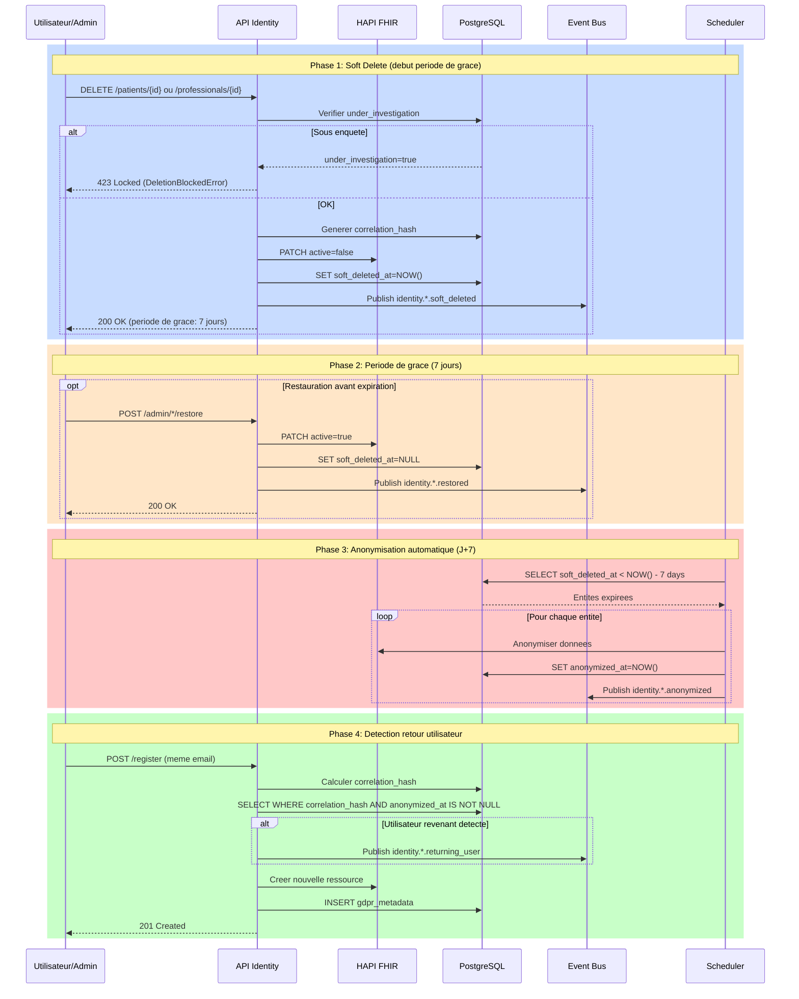
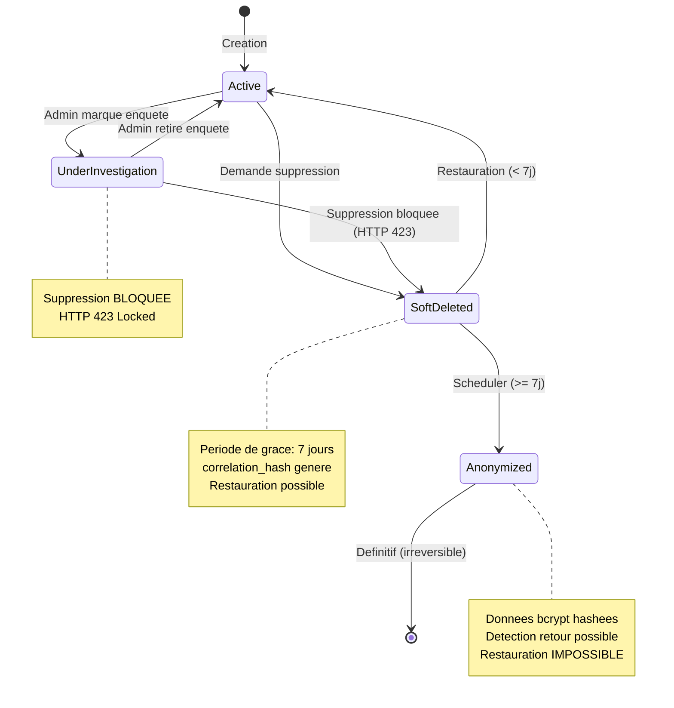
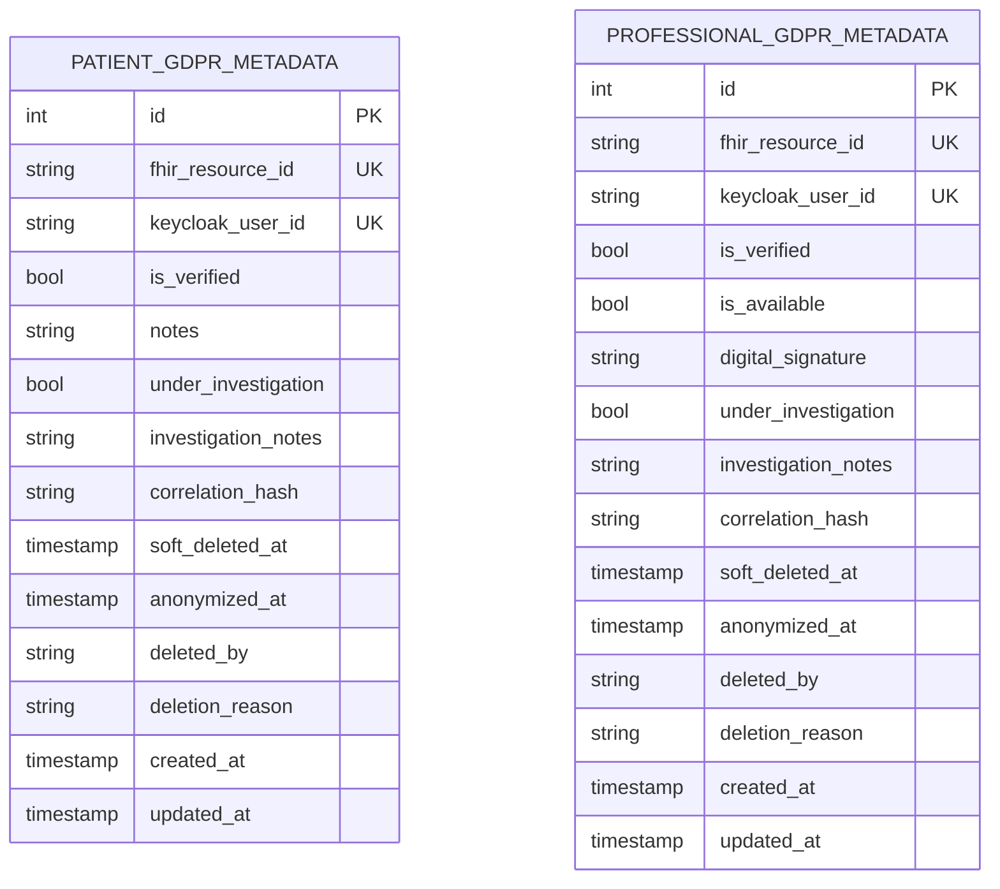
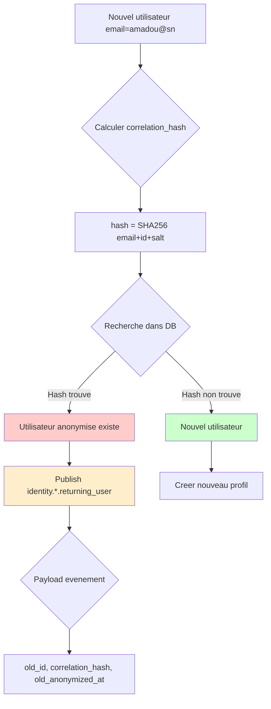

# Workflow de Suppression RGPD

> **Architecture FHIR (Decembre 2025)**
>
> Ce workflow s'applique a l'architecture hybride FHIR:
> - Donnees demographiques: **HAPI FHIR** (Patient/Practitioner)
> - Metadonnees GDPR: **PostgreSQL** (patient_gdpr_metadata, professional_gdpr_metadata)
>
> Voir `docs/architecture/fhir-hybrid.md` pour details.

## Vue d'ensemble

Workflow de suppression conforme RGPD Article 17 (droit a l'effacement):

- Periode de grace de **7 jours** avant anonymisation
- Anonymisation automatique apres expiration
- Detection des utilisateurs revenant apres anonymisation
- Blocage de suppression pendant enquetes
- Tracabilite complete via evenements
- Reversibilite pendant periode de grace

---

## Architecture

### Workflow en 4 Phases



### Etats du Cycle de Vie



---

## Modele de Donnees

### Metadonnees GDPR (PostgreSQL)



### Champs RGPD

| Champ | Type | Description |
|-------|------|-------------|
| under_investigation | bool | Blocage suppression |
| investigation_notes | varchar(1000) | Notes enquete |
| correlation_hash | varchar(64) | SHA-256 pour detection retour |
| soft_deleted_at | timestamptz | Debut periode de grace |
| anonymized_at | timestamptz | Anonymisation definitive |
| deleted_by | string | UUID admin ayant supprime |
| deletion_reason | string | Raison de suppression |

### Raisons de Suppression

```python
# Patients
PatientDeletionReason = Literal[
    "user_request",           # Demande utilisateur
    "gdpr_compliance",        # Conformite RGPD Article 17
    "admin_action",           # Action administrative
    "prolonged_inactivity",   # Inactivite prolongee
    "duplicate_account",      # Compte en double
    "deceased"                # Deces patient
]

# Professionnels
ProfessionalDeletionReason = Literal[
    "user_request",           # Demande utilisateur
    "admin_termination",      # Fin de contrat
    "professional_revocation", # Revocation licence
    "gdpr_compliance",        # Conformite RGPD
    "prolonged_inactivity",   # Inactivite prolongee
]
```

---

## Correlation Hash

### Generation

```python
def _generate_correlation_hash(email: str, identifier: str | None = None) -> str:
    """Hash SHA-256 deterministe pour correlation anonymisee.

    Permet de detecter si un utilisateur revient apres anonymisation
    sans stocker de donnees personnelles en clair.
    """
    salt = settings.CORRELATION_HASH_SALT
    hash_input = f"{email}|{identifier or ''}|{salt}"
    return hashlib.sha256(hash_input.encode("utf-8")).hexdigest()
```

### Flux de Detection



### Avantages

1. **Anonymisation complete**: Pas de donnees personnelles en clair
2. **Detection fiable**: Hash deterministe SHA-256
3. **Conformite RGPD**: Statistiques sans identifier individus
4. **Tracabilite**: Audit des retours utilisateurs
5. **Securite**: Salt configurable par environnement

---

## Anonymisation

### Donnees Anonymisees

| Donnee | Methode | Resultat |
|--------|---------|----------|
| first_name | bcrypt(12 rounds) | $2b$12$... |
| last_name | bcrypt(12 rounds) | $2b$12$... |
| email | bcrypt(12 rounds) | $2b$12$... |
| phone | Remplacement | +ANONYMIZED |
| phone_secondary | Suppression | NULL |

### Donnees Preservees

| Donnee | Raison |
|--------|--------|
| correlation_hash | Detection retours |
| professional_type | Agregation statistique |
| specialty | Agregation statistique |
| created_at | Audit |
| anonymized_at | Tracabilite |

### Scheduler d'Anonymisation

```python
# Execution quotidienne a 2h du matin
@scheduler.scheduled_job(CronTrigger(hour=2, minute=0))
async def run_anonymization():
    async with get_session() as db:
        count = await anonymize_expired_deletions(db)
        logger.info(f"Anonymisation: {count} entites traitees")
```

---

## Endpoints Admin

### Patients

| Endpoint | Methode | Description |
|----------|---------|-------------|
| /admin/patients/{id}/investigation | POST | Marquer sous enquete |
| /admin/patients/{id}/investigation | DELETE | Retirer statut enquete |
| /admin/patients/{id}/restore | POST | Restaurer (periode grace) |
| /admin/patients/deleted | GET | Lister soft deleted |
| /admin/patients/{id} | DELETE | Suppression RGPD definitive |

### Professionnels

| Endpoint | Methode | Description |
|----------|---------|-------------|
| /admin/professionals/{id}/investigation | POST | Marquer sous enquete |
| /admin/professionals/{id}/investigation | DELETE | Retirer statut enquete |
| /admin/professionals/{id}/restore | POST | Restaurer (periode grace) |
| /admin/professionals/deleted | GET | Lister soft deleted |
| /admin/professionals/{id} | DELETE | Suppression RGPD definitive |

---

## Evenements Publies

| Evenement | Trigger | Payload |
|-----------|---------|---------|
| identity.*.soft_deleted | Soft delete | id, keycloak_user_id, correlation_hash, soft_deleted_at, deletion_reason, grace_period_days |
| identity.*.anonymized | Scheduler J+7 | id, anonymized_at, soft_deleted_at, deletion_reason |
| identity.*.returning_user | Hash match | old_id, old_keycloak_user_id, new_keycloak_user_id, correlation_hash, old_anonymized_at |
| identity.*.investigation_started | Admin marque | id, keycloak_user_id, investigation_notes, marked_at |
| identity.*.investigation_cleared | Fin enquete | id, keycloak_user_id, cleared_at |
| identity.*.restored | Restauration | id, keycloak_user_id, restore_reason, restored_at |

---

## Conformite RGPD

### Article 17 - Droit a l'effacement

| Exigence | Implementation |
|----------|----------------|
| Droit de suppression | Endpoint DELETE disponible |
| Delai raisonnable | Periode de grace 7 jours |
| Anonymisation | Bcrypt irreversible apres 7 jours |
| Tracabilite | Evenements publies pour audit |
| Detection retour | Correlation hash anonymise |

### Duree de Conservation

| Etat | Duree | Action |
|------|-------|--------|
| Actif | Indefini | Tant que compte actif |
| Soft deleted | 7 jours | Periode de grace |
| Anonymise | Permanent | Statistiques anonymes |

### Documentation DPO

- **Registre des traitements**: Inclure ce workflow
- **DPIA**: Analyse d'impact effectuee
- **Politique de retention**: 7 jours documentes
- **Droits des personnes**: Effacement + restauration

---

## Configuration

### Variables d'Environnement

```bash
# Salt pour correlation_hash
CORRELATION_HASH_SALT=africare-identity-salt-v1-production

# Scheduler
SCHEDULER_TIMEZONE=UTC
ANONYMIZATION_CRON_HOUR=2
ANONYMIZATION_CRON_MINUTE=0
```

### Demarrage Scheduler

```python
# app/main.py
@asynccontextmanager
async def lifespan(app: FastAPI):
    scheduler.start()
    logger.info("Scheduler APScheduler demarre")
    yield
    scheduler.shutdown()
```

---

## Troubleshooting

### Entite ne s'anonymise pas apres 7 jours

**Diagnostic**:
```sql
SELECT id, soft_deleted_at, anonymized_at
FROM patient_gdpr_metadata
WHERE soft_deleted_at IS NOT NULL AND anonymized_at IS NULL;
```

**Solutions**:
1. Verifier soft_deleted_at non NULL
2. Verifier scheduler demarre
3. Verifier timezone correcte

### Erreur 423 Locked inattendue

**Cause**: under_investigation=true

**Solution**:
```bash
curl -X DELETE http://localhost:8001/api/v1/admin/patients/{id}/investigation
```

### Detection retour echoue

**Diagnostic**:
```sql
SELECT id, email, correlation_hash, anonymized_at
FROM patient_gdpr_metadata
WHERE anonymized_at IS NOT NULL AND correlation_hash IS NULL;
```

**Solution**: Regenerer les hashes manquants.

---

## References

- **RGPD Article 17**: Droit a l'effacement
- **RFC 9457**: Problem Details for HTTP APIs
- **Architecture FHIR**: docs/architecture/fhir-hybrid.md
