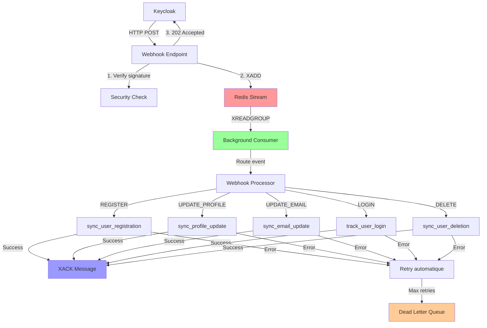
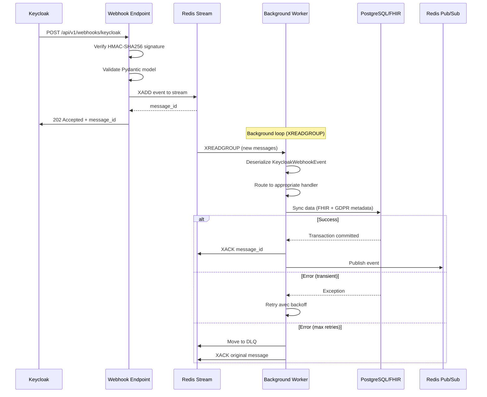
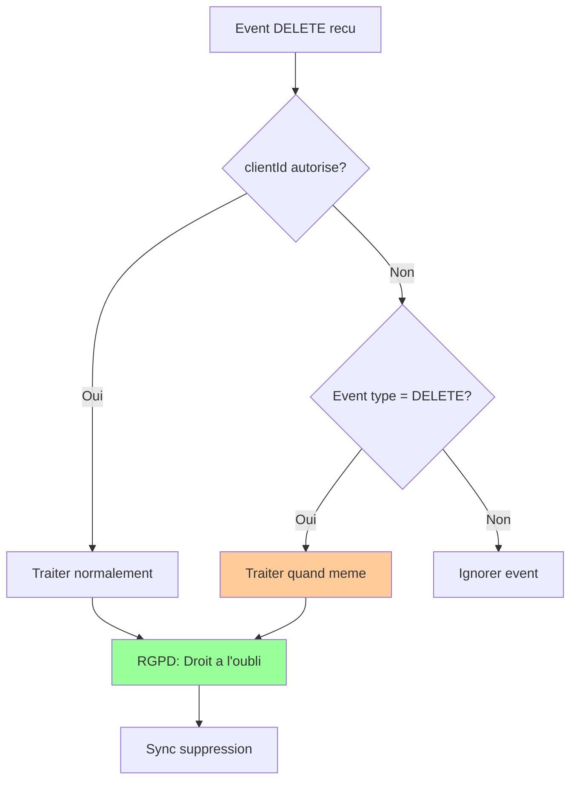
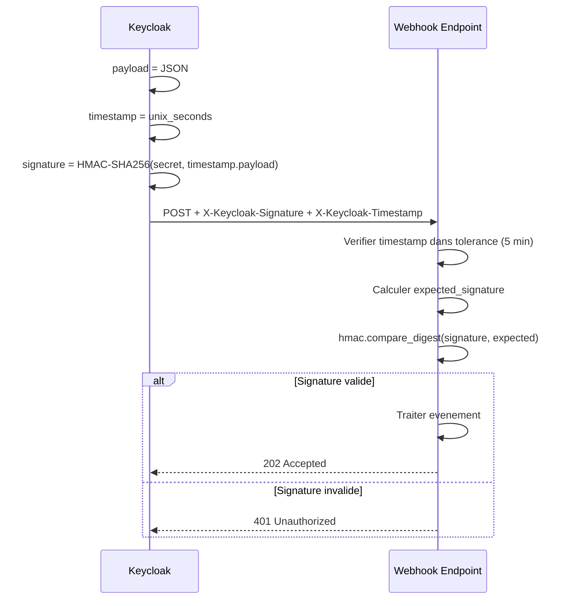
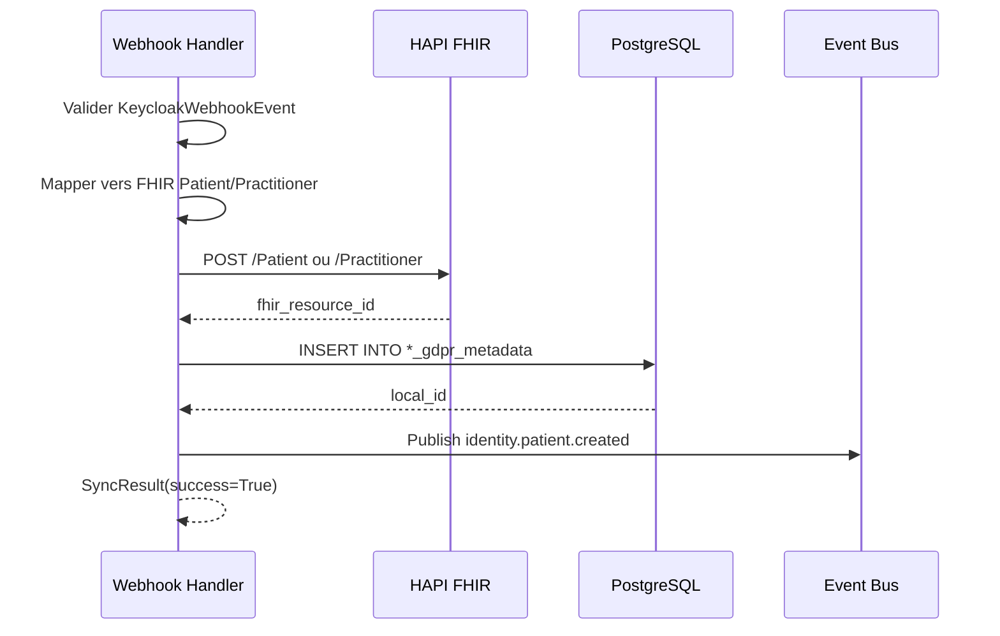

# Webhooks Keycloak - Architecture Complete

Ce document decrit l'architecture complete des webhooks Keycloak utilisant Redis Streams pour la synchronisation temps-reel.

## Table des matieres

- [Vue d'ensemble](#vue-densemble)
- [Architecture](#architecture)
- [Configuration Keycloak](#configuration-keycloak)
- [Filtrage par Client](#filtrage-par-client)
- [Validation Temporelle](#validation-temporelle)
- [Securite](#securite)
- [Traitement des Evenements](#traitement-des-evenements)
- [Monitoring](#monitoring)
- [Troubleshooting](#troubleshooting)

---

## Vue d'ensemble

### Problematique

L'architecture webhook synchrone traditionnelle presente des limitations critiques:

- **Perte d'evenements**: Si le service crash, l'evenement Keycloak est perdu
- **Timeout Keycloak**: Traitement long cause des timeouts
- **Pas de retry**: Echec = perte definitive
- **Pas de monitoring**: Difficile de savoir quels evenements ont echoue

### Solution Redis Streams

Redis Streams offre une solution complete:

- Persistence des messages (survivent aux redemarrages)
- Consumer groups pour scalabilite horizontale
- Acknowledgement explicite (XACK)
- Retry automatique des messages non-ACK
- Dead Letter Queue (DLQ)
- Monitoring via XPENDING et XINFO

---

## Architecture

### Diagramme Global



### Flux de Traitement



### Comparaison Avant/Apres

| Avant (Synchrone) | Apres (Redis Streams) |
|-------------------|----------------------|
| Perte evenements au crash | Persistence Redis |
| Pas de retry | Retry automatique XCLAIM |
| Timeout Keycloak | 202 Accepted immediat |
| Monitoring limite | 9 metriques OpenTelemetry |
| 1 worker | Consumer groups (scaling) |

---

## Configuration Keycloak

### Prerequis

- Keycloak 17+ installe
- Realm `africare` cree
- Plugin webhook custom deploye

### Event Listeners

```json
{
  "eventsEnabled": true,
  "eventsExpiration": 2592000,
  "eventsListeners": ["jboss-logging", "custom-webhook-listener"],
  "enabledEventTypes": [
    "REGISTER",
    "LOGIN",
    "UPDATE_PROFILE",
    "UPDATE_EMAIL",
    "VERIFY_EMAIL",
    "LOGOUT"
  ],
  "adminEventsEnabled": true,
  "adminEventsDetailsEnabled": true
}
```

### Attributs Utilisateur Requis

```yaml
# User Profile Keycloak
attributes:
  first_name: { required: true }
  last_name: { required: true }
  date_of_birth: { required: true, format: "YYYY-MM-DD" }
  gender: { required: true, options: ["male", "female"] }
  phone: { required: false, format: "E.164" }
  country: { default: "Senegal" }
  preferred_language: { default: "fr" }
```

### Variables d'Environnement

```bash
# Dans Keycloak (plugin)
WEBHOOK_URL=https://identity.africare.app/api/v1/webhooks/keycloak
WEBHOOK_SECRET=your-64-char-hex-secret

# Dans core-africare-identity
WEBHOOK_SECRET=your-64-char-hex-secret
WEBHOOK_SIGNATURE_TOLERANCE=300
```

---

## Filtrage par Client

### Clients Autorises

Seuls les evenements des portails metier sont synchronises:

```python
ALLOWED_CLIENT_IDS = {
    "apps-africare-patient-portal",
    "apps-africare-provider-portal",
}
```

### Regles de Filtrage

| Type Evenement | clientId | Comportement | Raison |
|---------------|----------|--------------|--------|
| ADMIN_UPDATE | any/null | **Ignore** | Console admin |
| ADMIN_* | any | **Ignore** | Tous events admin |
| DELETE | null/any | **Traite** | RGPD - toujours sync |
| REGISTER | autorise | **Traite** | Inscription portail |
| REGISTER | non autorise | **Ignore** | Admin console |
| UPDATE_PROFILE | autorise | **Traite** | Mise a jour portail |
| UPDATE_PROFILE | non autorise | **Ignore** | Admin console |

### Pourquoi DELETE est Toujours Traite



Les evenements DELETE sont **toujours** synchronises pour:
1. Suppression admin legitime
2. Auto-suppression patient/professionnel
3. Integrite RGPD (droit a l'oubli)

---

## Validation Temporelle

### Fenetre de Validation

```python
# app/schemas/keycloak.py
@field_validator("event_time")
def validate_event_time(cls, v: int) -> int:
    now_ms = int(datetime.now().timestamp() * 1000)
    thirty_days_ms = 30 * 24 * 60 * 60 * 1000

    # Accepte: derniers 30 jours OU +1h futur
    if v < (now_ms - thirty_days_ms) or v > (now_ms + 3600000):
        raise ValueError(f"Timestamp invalide: {v}")
    return v
```

### Justification 30 Jours

| Scenario | Couvert |
|----------|---------|
| Incident production (quelques jours) | Oui |
| Maintenance planifiee avec backlog | Oui |
| Disaster recovery | Oui |
| Replay manuel pour correction | Oui |

---

## Securite

### Verification Signature HMAC-SHA256



### Protections

| Attaque | Protection |
|---------|------------|
| Replay | Tolerance timestamp 5 min |
| Timing | hmac.compare_digest() |
| Rate limiting | Reverse proxy |
| Man-in-the-middle | HTTPS obligatoire |

### Generation du Secret

```bash
# Generer secret fort (64 caracteres hex)
openssl rand -hex 32

# Rotation recommandee: tous les 90 jours
```

---

## Traitement des Evenements

### Handlers Disponibles

```python
EVENT_HANDLERS = {
    "REGISTER": sync_user_registration,
    "UPDATE_PROFILE": sync_profile_update,
    "UPDATE_EMAIL": sync_email_update,
    "LOGIN": track_user_login,
    "DELETE": sync_user_deletion,
}
```

### Exemple: REGISTER



### Configuration Redis Streams

```python
WEBHOOK_STREAM_NAME = "keycloak:webhooks"
WEBHOOK_CONSUMER_GROUP = "core-africare-identity-workers"
MAX_DELIVERY_ATTEMPTS = 5
RETRY_BACKOFF_MS = 5000
CLAIM_IDLE_TIME_MS = 60000  # 1 minute
```

---

## Monitoring

### Metriques OpenTelemetry

| Metrique | Type | Description |
|----------|------|-------------|
| webhook.events.produced | Counter | Events XADD |
| webhook.events.consumed | Counter | Events XREADGROUP |
| webhook.events.acked | Counter | Events traites OK |
| webhook.events.failed | Counter | Events en echec |
| webhook.events.dlq | Counter | Events vers DLQ |
| webhook.processing.duration | Histogram | Duree traitement |
| webhook.consumer.lag | Gauge | Messages pending |
| webhook.dlq.length | Gauge | Taille DLQ |

### Requetes PromQL

```promql
# Consumer lag
webhook_consumer_lag{job="core-africare-identity"}

# Taux d'erreurs
rate(webhook_events_failed_total[5m])

# P95 duree traitement
histogram_quantile(0.95, rate(webhook_processing_duration_bucket[5m]))

# Throughput
rate(webhook_events_acked_total[1m])
```

### Alertes Recommandees

```yaml
groups:
  - name: webhook_alerts
    rules:
      - alert: WebhookConsumerLagHigh
        expr: webhook_consumer_lag > 100
        for: 5m
        labels:
          severity: warning

      - alert: WebhookDLQNotEmpty
        expr: webhook_dlq_length > 0
        for: 10m
        labels:
          severity: critical

      - alert: WebhookErrorRateHigh
        expr: rate(webhook_events_failed_total[5m]) > 0.1
        for: 5m
        labels:
          severity: warning
```

### Commandes Redis Utiles

```bash
# Info stream
redis-cli XINFO STREAM keycloak:webhooks

# Nombre messages
redis-cli XLEN keycloak:webhooks

# Messages pending
redis-cli XPENDING keycloak:webhooks core-africare-identity-workers

# Dead Letter Queue
redis-cli XLEN keycloak:webhooks:dlq
redis-cli XREAD COUNT 10 STREAMS keycloak:webhooks:dlq 0
```

---

## Troubleshooting

### Signature Invalide (401)

**Cause**: Secret incorrect ou timestamp expire

**Solution**:
```bash
# Verifier secrets identiques
echo $WEBHOOK_SECRET  # Keycloak
kubectl get secret webhook-secret -o yaml  # Service

# Verifier synchronisation NTP
timedatectl status
```

### Messages Bloques (PENDING)

**Diagnostic**:
```bash
redis-cli XPENDING keycloak:webhooks core-africare-identity-workers - + 100
```

**Solutions**:
1. Verifier logs consumer pour exceptions
2. Verifier connexion PostgreSQL/FHIR
3. Augmenter CLAIM_IDLE_TIME_MS si timeouts frequents

### DLQ se Remplit

**Diagnostic**:
```bash
redis-cli XREAD COUNT 10 STREAMS keycloak:webhooks:dlq 0
```

**Solutions**:
1. Analyser raisons d'echec (champ `reason`)
2. Corriger probleme source
3. Retraiter manuellement si necessaire:

```python
# Script retraitement DLQ
async def reprocess_dlq_message(message_id: str):
    messages = await redis.xread({"keycloak:webhooks:dlq": message_id}, count=1)
    for _, data in messages:
        event = KeycloakWebhookEvent.model_validate_json(data["payload"])
        new_id = await add_webhook_event(event)
        await redis.xdel("keycloak:webhooks:dlq", message_id)
```

### Patient/Professional Non Trouve

**Cause**: Event UPDATE/DELETE recu avant REGISTER

**Solution**:
1. Verifier ordre evenements Keycloak
2. Creer manuellement via API si necessaire

---

## References

- [Redis Streams Documentation](https://redis.io/docs/data-types/streams/)
- [Consumer Groups](https://redis.io/docs/data-types/streams-tutorial/#consumer-groups)
- [RFC 2104 - HMAC](https://tools.ietf.org/html/rfc2104)
- [Keycloak Event Listener SPI](https://www.keycloak.org/docs/latest/server_development/#_events)
