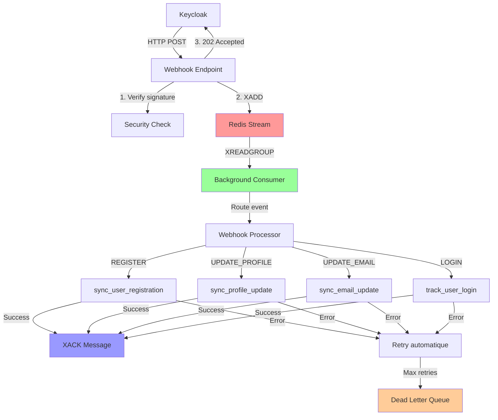
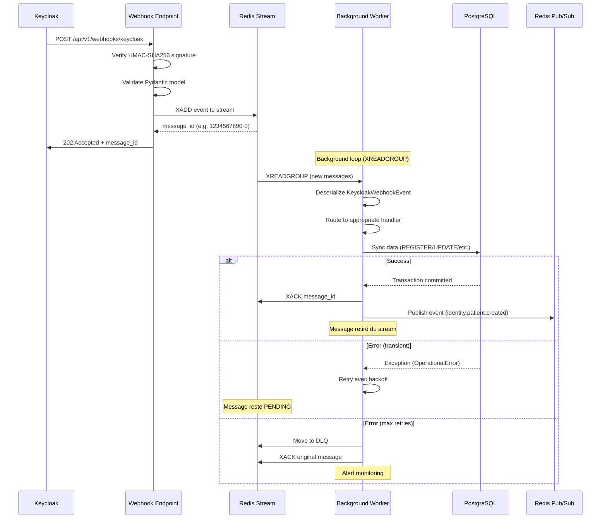
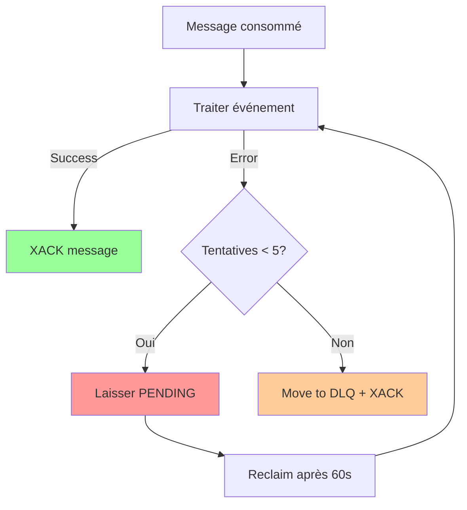

# Webhooks Keycloak - Architecture Résiliente avec Redis Streams

Ce document décrit l'architecture résiliente des webhooks Keycloak utilisant **Redis Streams** pour garantir la persistence, le retry automatique et la résilience aux pannes.

## Table des matières

- [Vue d'ensemble](#vue-densemble)
- [Architecture](#architecture)
- [Flux de données](#flux-de-données)
- [Composants](#composants)
- [Configuration](#configuration)
- [Monitoring et observabilité](#monitoring-et-observabilité)
- [Gestion des erreurs](#gestion-des-erreurs)
- [Troubleshooting](#troubleshooting)

## Vue d'ensemble

### Problématique

L'architecture webhook synchrone traditionnelle présente plusieurs limitations critiques:

- **Perte d'événements**: Si le service crash pendant le traitement, l'événement Keycloak est perdu
- **Timeout Keycloak**: Traitement long cause des timeouts côté Keycloak
- **Pas de retry**: Échec de traitement = perte définitive de la synchronisation
- **Pas de monitoring**: Difficile de savoir quels événements ont échoué

### Solution

**Redis Streams** offre une solution complète avec:

- Persistence des messages (survivent aux redémarrages)
- Consumer groups pour scalabilité horizontale
- Acknowledgement explicite (XACK) après traitement réussi
- Retry automatique des messages non-ACK
- Dead Letter Queue (DLQ) pour messages en échec répété
- Monitoring via XPENDING et XINFO

## Architecture

### Architecture globale



### Flux de traitement détaillé



## Composants

### 1. Webhook Endpoint (`app/api/v1/endpoints/webhooks.py`)

**Responsabilité**: Recevoir, valider et persister immédiatement les événements Keycloak.

**Processus**:
1. Vérification signature HMAC-SHA256
2. Validation Pydantic de l'événement
3. XADD au Redis Stream
4. Retour 202 Accepted immédiat

**Exemple de réponse**:

```json
{
  "accepted": true,
  "message_id": "1704067200000-0",
  "event_type": "REGISTER",
  "user_id": "abc123",
  "timestamp": "1704067200",
  "message": "Event accepted and queued for processing"
}
```

### 2. Redis Streams Module (`app/core/webhook_streams.py`)

**Configuration clé**:

```python
WEBHOOK_STREAM_NAME = "keycloak:webhooks"
WEBHOOK_CONSUMER_GROUP = "core-africare-identity-workers"
WEBHOOK_CONSUMER_NAME = "worker-1"  # Unique par instance/pod

MAX_DELIVERY_ATTEMPTS = 5
RETRY_BACKOFF_MS = 5000
CLAIM_IDLE_TIME_MS = 60000  # 1 minute
```

**Fonctions principales**:

- `add_webhook_event(event)`: XADD au stream (producer)
- `consume_webhook_events()`: Boucle XREADGROUP (consumer)
- `_reclaim_pending_messages()`: XCLAIM messages bloqués
- `_move_to_dead_letter(message_id, data)`: DLQ pour échecs répétés

### 3. Webhook Processor (`app/services/webhook_processor.py`)

**Responsabilité**: Router les événements vers le handler approprié.

**Mapping**:

```python
EVENT_HANDLERS = {
    "REGISTER": sync_user_registration,
    "UPDATE_PROFILE": sync_profile_update,
    "UPDATE_EMAIL": sync_email_update,
    "LOGIN": track_user_login,
}
```

### 4. Sync Handlers (`app/services/keycloak_sync_service.py`)

Handlers existants réutilisés sans modification:

- `sync_user_registration`: Crée patient dans PostgreSQL
- `sync_profile_update`: Met à jour profil patient
- `sync_email_update`: Met à jour email + verified flag
- `track_user_login`: Tracking analytics (pas de DB write)

## Configuration

### Variables d'environnement

```bash
# Redis (réutilise config existante)
REDIS_URL=redis://redis:6379
REDIS_DB=0

# Webhook Security (existant)
WEBHOOK_SECRET=your-shared-secret-with-keycloak
WEBHOOK_SIGNATURE_TOLERANCE=300  # 5 minutes
```

### Paramètres Redis Streams

Ces paramètres sont définis dans `app/core/webhook_streams.py`:

| Paramètre | Valeur par défaut | Description |
|-----------|-------------------|-------------|
| `WEBHOOK_STREAM_NAME` | `keycloak:webhooks` | Nom du Redis Stream |
| `WEBHOOK_CONSUMER_GROUP` | `core-africare-identity-workers` | Consumer group name |
| `MAX_DELIVERY_ATTEMPTS` | `5` | Nombre max de retries avant DLQ |
| `RETRY_BACKOFF_MS` | `5000` | Délai entre retries (5s) |
| `CLAIM_IDLE_TIME_MS` | `60000` | Temps avant reclaim (1min) |

## Monitoring et observabilité

### Commandes Redis utiles

#### Statistiques du stream

```bash
# Info générale sur le stream
redis-cli XINFO STREAM keycloak:webhooks

# Nombre de messages dans le stream
redis-cli XLEN keycloak:webhooks

# Info sur le consumer group
redis-cli XINFO GROUPS keycloak:webhooks

# Info sur les consumers
redis-cli XINFO CONSUMERS keycloak:webhooks core-africare-identity-workers
```

#### Messages pending

```bash
# Liste des messages pending (non-ACK)
redis-cli XPENDING keycloak:webhooks core-africare-identity-workers

# Détails des messages pending
redis-cli XPENDING keycloak:webhooks core-africare-identity-workers - + 10
```

#### Dead Letter Queue

```bash
# Messages dans la DLQ
redis-cli XLEN keycloak:webhooks:dlq

# Lire les messages DLQ
redis-cli XREAD COUNT 10 STREAMS keycloak:webhooks:dlq 0
```

### OpenTelemetry Spans

Tous les composants émettent des spans OpenTelemetry:

- `receive_keycloak_webhook`: Endpoint HTTP
- `add_webhook_event`: Producer (XADD)
- `process_webhook_message`: Consumer (XREADGROUP)
- `route_webhook_event`: Router
- `sync_user_registration` (etc.): Handlers spécifiques

### Métriques OpenTelemetry

Le système webhook expose automatiquement des métriques OpenTelemetry qui peuvent être exportées vers Prometheus, Grafana, ou tout autre backend compatible.

#### Counters (cumulative)

| Métrique | Type | Description | Labels |
|----------|------|-------------|--------|
| `webhook.events.produced` | Counter | Événements persistés dans Redis Streams (XADD) | `event_type` |
| `webhook.events.consumed` | Counter | Événements consommés depuis Redis Streams (XREADGROUP) | `event_type` |
| `webhook.events.acked` | Counter | Événements traités avec succès (XACK) | `event_type` |
| `webhook.events.failed` | Counter | Événements en échec (exceptions ou handler failure) | `event_type`, `reason` |
| `webhook.events.dlq` | Counter | Événements déplacés vers Dead Letter Queue | `event_type` |
| `webhook.events.retried` | Counter | Événements reclaimed pour retry (XCLAIM) | - |

#### Histograms

| Métrique | Type | Description | Labels |
|----------|------|-------------|--------|
| `webhook.processing.duration` | Histogram | Durée de traitement des événements (secondes) | `event_type`, `success` |

#### Gauges (observables)

| Métrique | Type | Description | Fréquence |
|----------|------|-------------|-----------|
| `webhook.consumer.lag` | Gauge | Nombre de messages pending (non-ACK) | Callback async |
| `webhook.dlq.length` | Gauge | Nombre de messages dans la DLQ | Callback async |

#### Exemples de requêtes PromQL

**Consumer lag (messages en attente):**
```promql
webhook_consumer_lag{job="core-africare-identity"}
```

**Taux d'erreurs:**
```promql
rate(webhook_events_failed_total[5m])
```

**P95 durée de traitement:**
```promql
histogram_quantile(0.95,
  rate(webhook_processing_duration_bucket[5m])
)
```

**Messages en DLQ:**
```promql
webhook_dlq_length{job="core-africare-identity"}
```

**Throughput (événements/seconde):**
```promql
rate(webhook_events_acked_total[1m])
```

#### Dashboard Grafana recommandé

Variables:
- `$job` = `core-africare-identity`
- `$event_type` = label `event_type`

Panneaux suggérés:
1. **Consumer Lag** (Gauge): `webhook_consumer_lag`
2. **DLQ Length** (Gauge): `webhook_dlq_length`
3. **Throughput** (Graph): `rate(webhook_events_acked_total[5m])`
4. **Error Rate** (Graph): `rate(webhook_events_failed_total[5m])`
5. **Processing Duration P95** (Graph): `histogram_quantile(0.95, ...)`
6. **Events by Type** (Pie chart): `sum by (event_type) (webhook_events_consumed_total)`

#### Alertes recommandées

```yaml
# Prometheus alerts
groups:
  - name: webhook_alerts
    rules:
      - alert: WebhookConsumerLagHigh
        expr: webhook_consumer_lag > 100
        for: 5m
        labels:
          severity: warning
        annotations:
          summary: "Consumer lag élevé ({{ $value }} messages pending)"

      - alert: WebhookDLQNotEmpty
        expr: webhook_dlq_length > 0
        for: 10m
        labels:
          severity: critical
        annotations:
          summary: "DLQ non vide ({{ $value }} messages en échec)"

      - alert: WebhookErrorRateHigh
        expr: rate(webhook_events_failed_total[5m]) > 0.1
        for: 5m
        labels:
          severity: warning
        annotations:
          summary: "Taux d'erreurs élevé ({{ $value }}/s)"

      - alert: WebhookProcessingDurationHigh
        expr: histogram_quantile(0.95, rate(webhook_processing_duration_bucket[5m])) > 5
        for: 5m
        labels:
          severity: warning
        annotations:
          summary: "Durée de traitement élevée (P95: {{ $value }}s)"
```

### Logs structurés

Exemples de logs:

```
INFO  Webhook reçu: type=REGISTER, user_id=abc123, realm=africare
INFO  Webhook persisté: type=REGISTER, user_id=abc123, message_id=1704067200000-0
INFO  Traitement webhook message: id=1704067200000-0, type=REGISTER, attempt=1
INFO  Handler exécuté: type=REGISTER, success=True, message=Patient created: 42
INFO  Webhook traité avec succès: id=1704067200000-0, type=REGISTER
```

## Gestion des erreurs

### Stratégie de retry



### Types d'erreurs

#### 1. Erreurs transitoires (retry automatique)

- `OperationalError`: Connexion DB perdue, timeout
- `DBAPIError`: Erreurs DB temporaires
- Exceptions réseau

**Comportement**: Message reste PENDING, reclaim après 60s, retry automatique

#### 2. Erreurs permanentes (pas de retry)

- Validation Pydantic échouée
- Type d'événement non supporté
- Données manquantes (first_name, last_name, etc.)

**Comportement**: Log ERROR + move to DLQ immédiatement

#### 3. Échecs répétés (DLQ)

Après 5 tentatives, le message est déplacé vers `keycloak:webhooks:dlq` avec métadonnées:

```json
{
  "original_message_id": "1704067200000-0",
  "event_type": "REGISTER",
  "user_id": "abc123",
  "payload": "...",
  "delivery_attempts": "5",
  "failed_at": "2024-01-01T12:00:00+00:00",
  "reason": "Max delivery attempts (5) exceeded"
}
```

### Health Check

Endpoint: `GET /api/v1/webhooks/keycloak/health`

```json
{
  "status": "healthy",
  "webhook_endpoint": "/api/v1/webhooks/keycloak",
  "last_event_received": "2024-01-01T12:00:00",
  "total_events_processed": 1000,
  "failed_events_count": 5
}
```

**Note**: Ces stats reflètent uniquement la persistence (XADD), pas le traitement asynchrone. Utiliser `XPENDING` pour les stats de traitement.

## Troubleshooting

### Symptômes et solutions

#### Messages bloqués dans PENDING

**Symptôme**: `XPENDING` montre beaucoup de messages

**Diagnostic**:

```bash
redis-cli XPENDING keycloak:webhooks core-africare-identity-workers - + 100
```

**Solutions**:

1. Vérifier les logs du consumer pour exceptions
2. Vérifier la connexion PostgreSQL
3. Augmenter `CLAIM_IDLE_TIME_MS` si timeouts fréquents
4. Manuellement XCLAIM et retraiter

#### DLQ se remplit

**Symptôme**: `XLEN keycloak:webhooks:dlq` augmente

**Diagnostic**:

```bash
# Lire les messages DLQ
redis-cli XREAD COUNT 10 STREAMS keycloak:webhooks:dlq 0
```

**Solutions**:

1. Analyser les raisons d'échec (champ `reason`)
2. Corriger le problème source (données manquantes, etc.)
3. Manuellement retraiter via script si nécessaire

#### Consumer ne démarre pas

**Symptôme**: Logs `Aucun handler webhook enregistré, consommation non démarrée`

**Solution**:

Vérifier que `register_webhook_handler()` est bien appelé avant `start_webhook_consumer()` dans `main.py`.

#### Events perdus après redémarrage

**Diagnostic**:

```bash
# Vérifier consumer group existe
redis-cli XINFO GROUPS keycloak:webhooks
```

**Solution**:

Le consumer group est créé automatiquement au démarrage avec `mkstream=True`. Si messages perdus, vérifier les logs d'erreur au démarrage.

### Scripts utiles

#### Retraiter message de la DLQ

```python
# Script Python pour retraiter un message DLQ
import redis.asyncio as redis
from app.core.webhook_streams import add_webhook_event
from app.schemas.keycloak import KeycloakWebhookEvent

async def reprocess_dlq_message(message_id: str):
    r = redis.from_url("redis://localhost:6379", decode_responses=True)

    # Lire message de la DLQ
    messages = await r.xread({"keycloak:webhooks:dlq": message_id}, count=1)

    for stream, stream_messages in messages:
        for msg_id, data in stream_messages:
            # Recréer l'événement
            event = KeycloakWebhookEvent.model_validate_json(data["payload"])

            # Réinjecter dans le stream principal
            new_id = await add_webhook_event(event)

            print(f"Message retraité: {msg_id} → {new_id}")

            # Optionnel: supprimer de la DLQ
            await r.xdel("keycloak:webhooks:dlq", msg_id)
```

#### Purger la DLQ

```bash
# ATTENTION: Supprime tous les messages DLQ
redis-cli DEL keycloak:webhooks:dlq
```

## Comparaison avec architecture précédente

| Critère | Synchrone (avant) | Redis Streams (après) |
|---------|-------------------|----------------------|
| **Persistence** | Aucune | Messages persistés sur disque |
| **Resilience pannes** | Événements perdus au crash | Survivent aux redémarrages |
| **Retry** | Tenacity (mémoire only) | Retry automatique (XPENDING) |
| **Timeout Keycloak** | Possible si traitement long | 202 Accepted immédiat |
| **Monitoring** | Stats en mémoire | XPENDING, XINFO, DLQ |
| **Scalabilité** | Limitée (1 worker) | Consumer groups (N workers) |
| **Idempotence** | Manuelle | Message IDs uniques |
| **Dead Letter Queue** | Aucune | DLQ automatique après 5 retries |

## Best practices

1. **Monitoring proactif**: Configurer alertes sur:
   - `XPENDING` count > threshold
   - `DLQ length` > 0
   - Consumer lag (via XINFO)

2. **Tuning paramètres**:
   - Ajuster `MAX_DELIVERY_ATTEMPTS` selon criticité
   - Adapter `CLAIM_IDLE_TIME_MS` selon charge

3. **Consumer groups multiples**:
   - Pour scaling horizontal, lancer plusieurs instances
   - Redis Streams distribue automatiquement les messages

4. **Backup DLQ**:
   - Exporter régulièrement la DLQ vers fichier/DB
   - Analyser patterns d'échecs

5. **Tests de resilience**:
   - Simuler crashes pendant traitement
   - Vérifier que messages sont retraités
   - Tester comportement DLQ

## Références

- [Redis Streams Documentation](https://redis.io/docs/data-types/streams/)
- [Consumer Groups](https://redis.io/docs/data-types/streams-tutorial/#consumer-groups)
- [XREADGROUP Command](https://redis.io/commands/xreadgroup/)
- [XACK Command](https://redis.io/commands/xack/)
